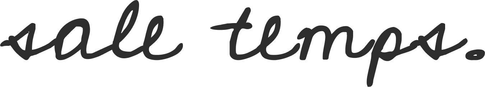

[](https://sale-temps.netlify.com/)
[Go to website](https://sale-temps.netlify.com/)

This is a static website showcasing **Kolo**, a totally innovative and unique jacket by _sale-temps_. Using a special ink you can draw and customize your jacket as you wish.


The website is all static using HTML & SASS. We created a bunch of cool animations to make the website stand out and to quickly give user informations about sale-temps products.


## How to visit the website ?

Go to [https://sale-temps.netlify.com/](https://sale-temps.netlify.com/) or just click on the _sale-temps._ logo on top of the read me.

## How to run the website on my computer ?

Just clone the repository and after installing all the packages run this command in the terminal.

```shell
npm run build
```

## Group members of the project

- [Reda Hamouche](https://github.com/RedaHamouche)
- [Hugo Borini](https://github.com/hugoborini)
- [Hugo Cordillot](https://github.com/Hgo0123)
- [Maëva Wolff](https://github.com/MaevaWolff)
- [Quentin Grancher](https://github.com/quentingrchr)
